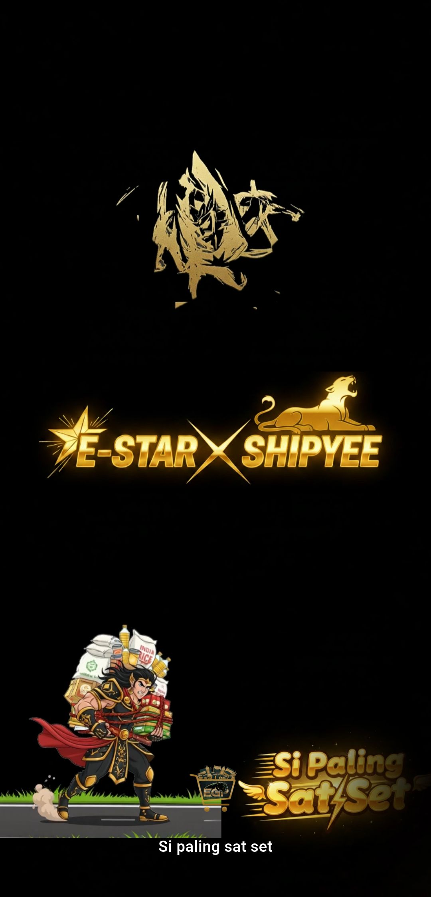
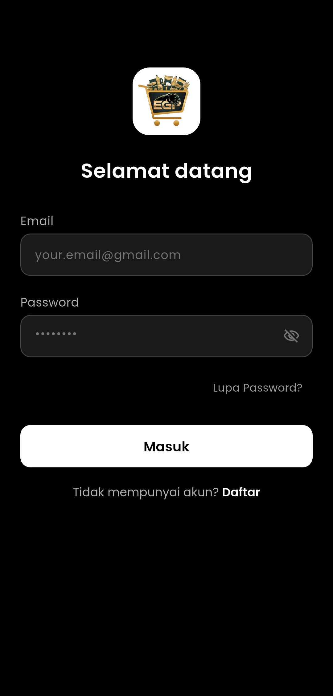
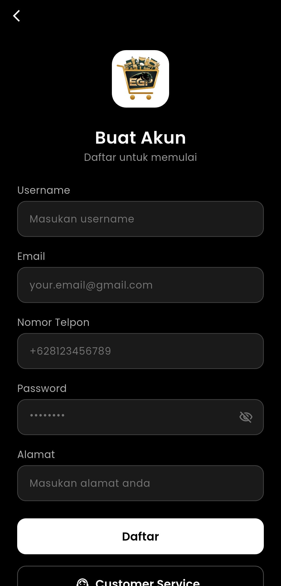
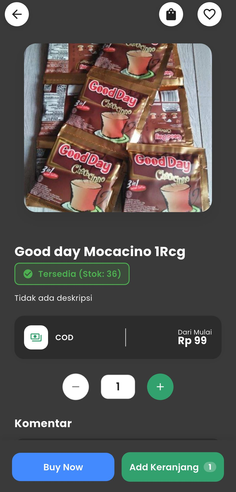
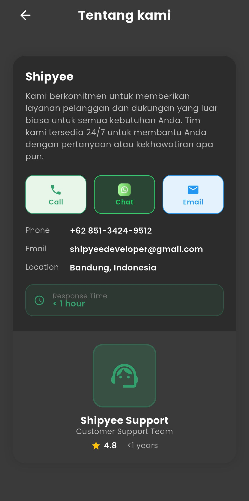
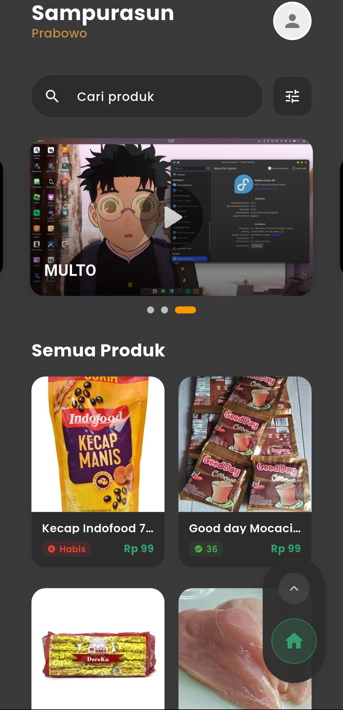
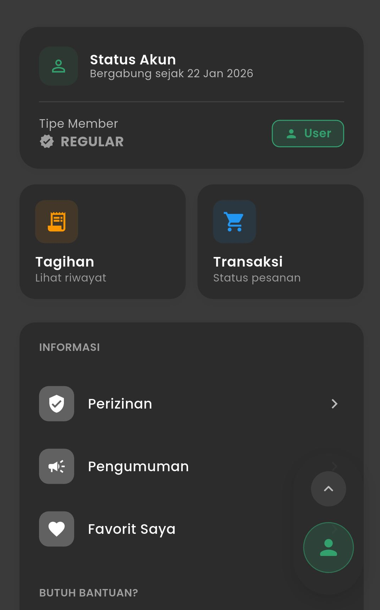

  
  <h1>Shipyee</h1>

  

    

  [**🇮🇩 Bahasa Indonesia**](#-bahasa-indonesia) &nbsp;|&nbsp; [**🇺🇸 English**](#-english)

**App Shipyee - Ecommerce Sembako Lokal**

---

# 🇮🇩 Bahasa Indonesia

## 📱 Tentang Aplikasi

**Shipyee** adalah aplikasi **ecommerce sembako lokal** (project perorangan) yang dikembangkan khusus untuk klien berinisial **'E'**. Aplikasi ini dirancang untuk mempermudah proses belanja kebutuhan sehari-hari secara online dengan sistem pengiriman yang efisien.

> [!IMPORTANT]
> **NOTE**: Aplikasi ini HANYA untuk client tertentu dan **tidak bisa dipakai bebas** oleh publik.
> Terdapat **fitur enkripsi** keamanan dimana setiap pengguna baru **harus mendapatkan approval (persetujuan)** dari admin untuk bisa masuk dan menggunakan aplikasi.
>
> *Project ini didokumentasikan sebagai bagian dari portofolio **dbasitbdw**. Halaman ini hanya untuk keperluan dokumentasi dan unduhan bagi klien tertentu.*

**(Halaman ini khusus untuk download aplikasi, bukan source code)**

---

## 📸 Screenshots

  
  
  
  
  
  
  

---

## 🛡️ Keamanan Terjamin (MobSF Scan)

Keamanan pengguna adalah prioritas utama kami. Aplikasi Shipyee telah melalui proses pemindaian keamanan yang ketat menggunakan **Mobile Security Framework (MobSF)** untuk memastikan bebas dari malware dan kerentanan keamanan.

✅ **Aman dari Virus & Malware**
✅ **Data Pengguna Terlindungi**

📄 **[Lihat Laporan Keamanan Lengkap (PDF)](public/report%20MOBSF%20app%20Shipyee.pdf)**

> *Klik link di atas untuk melihat bukti hasil scan keamanan resmi.*

---

## 📥 Panduan Instalasi (APK)

Ikuti langkah mudah berikut untuk menginstal aplikasi Shipyee di perangkat Android Anda:

1.  **Download APK**: Unduh file aplikasi Shipyee terbaru melalui link yang tersedia di repositori ini.
2.  **Izin Instalasi**: Jika muncul peringatan, masuk ke **Pengaturan > Keamanan** dan aktifkan pilihan **"Izinkan instalasi dari sumber tidak dikenal"** (Unknown Sources).
3.  **Install**: Buka file APK yang telah diunduh dan tekan tombol **Install**.
4.  **Selesai**: Tunggu proses selesai, dan aplikasi Shipyee siap digunakan!

---

## ❓ FAQ

**Q: Kenapa langsung versi 1.0.7?**

A: Versi **1.0.0** hingga **1.0.6** adalah tahap **Beta Test** internal. Versi **1.0.7** adalah rilis stabil pertama untuk publik.

---

## 📋 Informasi Teknis

| Kategori | Detail |
| :--- | :--- |
| **Platform** | Android |
| **Versi Minimal** | Android 5.0 (Lollipop) |
| **Ukuran Aplikasi** | 70 MB ++ |
| **Versi Aplikasi** | 1.0.7 |
| **Developer** | Pixxdev (dbasitbdw) |

  

---

# 🇺🇸 English

## 📱 About the App

**Shipyee** is a **local grocery ecommerce** application (personal project) developed specifically for a client with initial **'E'**. This application is designed to facilitate the process of shopping for daily necessities online with an efficient delivery system.

> [!IMPORTANT]
> **NOTE**: This application is ONLY for specific clients and **cannot be used freely** by the public.
> It features **security encryption** where every new user **must obtain approval** from the admin to access and use the application.
>
> *This project is documented as part of **dbasitbdw**'s portfolio. This page is solely for documentation and download purposes for specific clients.*

**(This page is strictly for application download, not for source code)**

---

## 📸 Screenshots

*(See screenshots in the Indonesian section above)*

---

## 🛡️ Security Guaranteed (MobSF Scan)

User security is our top priority. Shipyee has undergone rigorous security scanning using **Mobile Security Framework (MobSF)** to ensure it is free from malware and vulnerabilities.

✅ **Safe from Virus & Malware**
✅ **User Data Protected**

📄 **[View Complete Security Report (PDF)](public/report%20MOBSF%20app%20Shipyee.pdf)**

> *Click the link above to view the official security scan proof.*

---

## 📥 Installation Guide (APK)

Follow these easy steps to install the Shipyee application on your Android device:

1.  **Download APK**: Download the latest Shipyee application file via the link available in this repository.
2.  **Installation Permission**: If a warning appears, go to **Settings > Security** and enable the **"Allow installation from unknown sources"** option.
3.  **Install**: Open the downloaded APK file and press the **Install** button.
4.  **Done**: Wait for the process to finish, and the Shipyee application is ready to use!

---

## ❓ FAQ

**Q: Why start directly at version 1.0.7?**

A: Versions **1.0.0** to **1.0.6** were internal **Beta Test** stages. Version **1.0.7** is the first stable public release.

---

## 📋 Technical Information

| Category | Detail |
| :--- | :--- |
| **Platform** | Android |
| **Minimum Version** | Android 5.0 (Lollipop) |
| **App Size** | 70 MB ++ |
| **App Version** | 1.0.7 |
| **Developer** | Pixxdev (dbasitbdw) |

---

  <h3>🚀 Developed & Managed By</h3>
  
  
  &nbsp;
  
  
    
  
  <small>Copyright © 2026 Shipyee. All Rights Reserved.</small>

